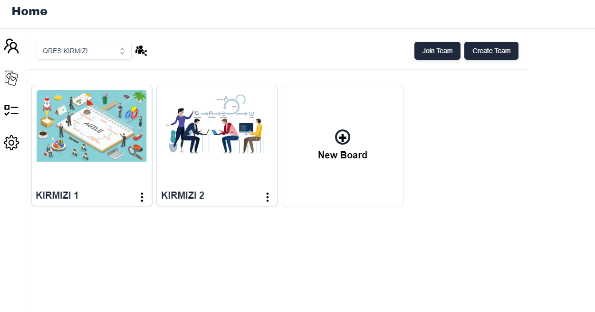
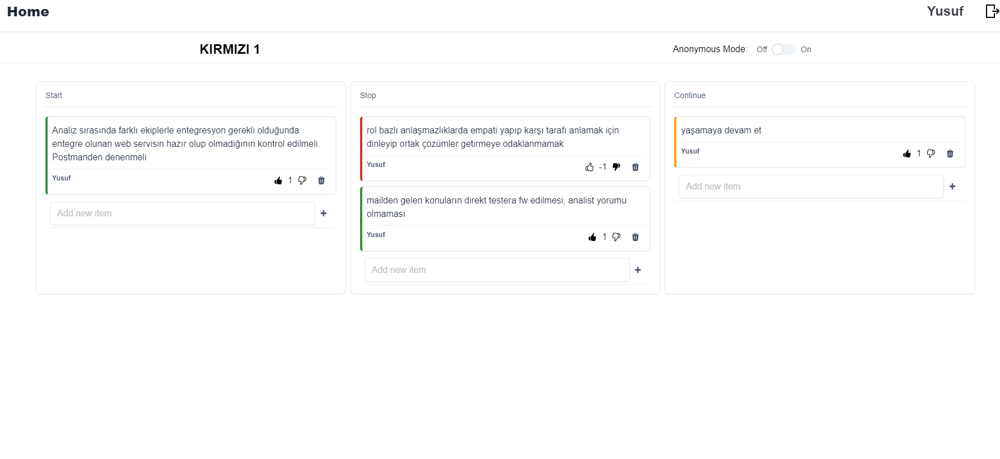

add .env filein project and insert this parameters

`VITE_FIREBASE_API_KEY: *****

VITE_FIREBASE_AUTH_DOMAIN: *****

VITE_FIREBASE_PROJECT_ID: *****

VITE_FIREBASE_STORAGE_BUCKET: ******

VITE_FIREBASE_MESSAGING_SENDER_ID: ******

VITE_FIREBASE_APP_ID: ********

VITE_FIREBASE_MEASUREMENT_ID: *********`

* npm install
* npm run dev

